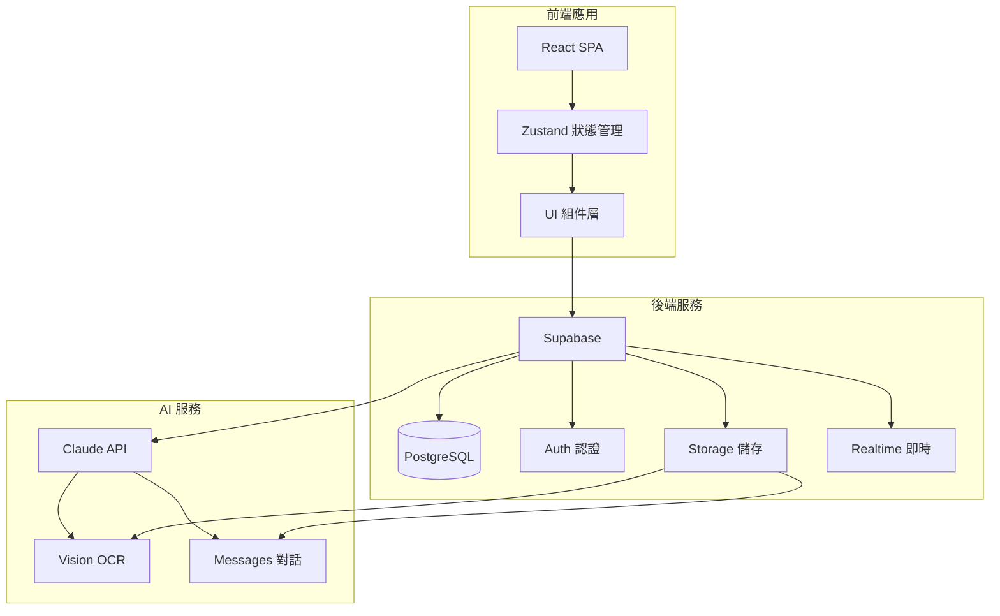

## 產品概述

**ULTRA_POS** - AI 驅動餐廳後台管理系統，專為香港糖水店「家傳x飲得」設計

## 核心功能

### Phase 1 - 後台管理系統（優先開發）

#### 1. HR 出糧系統

- **員工管理**：員工資料（姓名、聯絡、入職日期、時薪/月薪）
- **排班系統**：月曆視圖展示員工排班，支援新增/編輯/刪除班次
- **打卡系統**：員工上下班打卡，自動計算工時
- **薪資計算**：自動統計員工每月工時、加班、生成薪資報表

#### 2. 訂貨管理系統（核心功能）

整合**家傳x飲得 貨倉表.xlsx**的庫存數據，實現完整的訂貨流程：

**第一階段：員工請求訂貨**

- 員工查看倉庫存貨狀況（實時顯示各項庫存）
- 員工提出訂貨請求（選擇貨物、填寫數量、原因說明）
- 提交後進入待審批狀態

**第二階段：管理員處理訂貨**

- 管理員查看所有待處理訂貨請求
- 可批准、拒絕或修改訂貨數量
- 確認訂貨後生成訂單記錄

**第三階段：收貨確認與對比**

- 員工收到供應商送貨
- 掃描/選擇訂單，逐一確認收貨數量
- 系統自動對比：訂貨數量 vs 實際收貨數量
- 記錄差異（多發/少發/發錯）
- 更新倉庫庫存

**倉庫貨物表結構（來自 Excel）：**

| 類別 | 貨物名稱 | 現有庫存 |
| --- | --- | --- |
| 糖水配料 | 仙草粉、黑糖珍珠、西柚粒、紫米、椰果... | 400包、66包... |
| 茶用品 | 鴨屎香茶葉、飲品糖漿、飲管... | 多項 |
| 碗/杯/袋/用具 | 膠碗、膠杯、紙碗、膠袋... | 大量 |
| 煎餅配料 | Oreo碎、巧克力醬、沙律醬... | 多項 |
| 雜物 | 熱敏紙、保鮮膜、手套、貼紙... | 多項 |


#### 3. OCR 支出記帳

- **收據上傳**：支援圖片/PDF上傳
- **AI 識別**：使用 Claude Vision API 自動提取商戶名、日期、金額、項目
- **支出分類**：自動/手動分類支出（食材、租金、人工、水電、雜項）
- **月結報表**：自動生成月支出統計

#### 3. 產品管理系統

- **產品 CRUD**：新增/編輯/刪除產品
- **分類管理**：建立和管理產品分類（格仔餅、雞蛋仔、糖水、蒸點、飲品等）
- **價格管理**：設定產品價格、折扣
- **狀態控制**：員工可修改產品狀態（正常/停售/缺貨）
- **批量操作**：支援批量修改狀態

#### 4. AI 客服系統

- **智能問答**：AI 自動回答客人關於產品、營業時間等問題
- **知識庫**：自動學習產品資料回答常見問題
- **多語言支援**：繁體中文為主

### Phase 2 - AI 核心功能

#### 1. AI 菜單遷移

- **圖片/PDF 上傳**：上傳現有菜單圖片或 PDF
- **自動識別**：Claude Vision 識別菜品名稱、價格、分類
- **智能分類**：AI 自動將產品歸類到正確分類
- **批量確認**：生成產品列表供管理員確認後入庫

#### 2. 基礎報表系統

- **日/月營業額**：銷售數據統計
- **產品暢滯銷分析**：AI 分析哪些產品好賣/不好賣
- **時段分析**：分析旺淡時段
- **收支概覽**：收入與支出對比

## 用戶角色

| 角色 | 權限 |
| --- | --- |
| 店主 (Owner) | 全部功能、財務設置、系統配置 |
| 主管 (Manager) | 員工管理、產品管理、報表查看 |
| 員工 (Staff) | 修改產品狀態、打卡、排班查看 |


## 數據來源

- **家傳x飲得 貨倉表.xlsx**：庫存配料資料
- **Products.xlsx**：94項產品價格表

## 技術棧選擇

### 前端架構

| 層面 | 技術 | 說明 |
| --- | --- | --- |
| 框架 | React 18 + Vite | 快速開發、良好生態 |
| 樣式 | Tailwind CSS | 原子化CSS、快速客製化 |
| 狀態管理 | Zustand | 輕量、簡單易用 |
| UI組件 | shadcn/ui | 優質、無障礙、可自訂 |
| 圖表 | Recharts | 響應式數據可視化 |
| 表單 | React Hook Form + Zod | 類型安全、表單驗證 |


### 後端/數據庫

| 層面 | 技術 | 說明 |
| --- | --- | --- |
| 後端 | Supabase | BaaS（後端即服務） |
| 數據庫 | PostgreSQL | Supabase Hosted |
| 認證 | Supabase Auth | 員工登入系統 |
| 儲存 | Supabase Storage | 存放收據圖片、產品圖片 |
| 即時 | Supabase Realtime | 訂單即時更新（預留） |


### AI 集成

| 功能 | 技術 | 說明 |
| --- | --- | --- |
| 視覺識別 | Claude Vision API | OCR收據、AI菜單遷移 |
| 對話 | Claude Messages API | AI客服 |
| 分析 | Claude + 本地計算 | 數據洞察 |


### 語音（預留）

| 功能 | 技術 | 說明 |
| --- | --- | --- |
| 語音識別 | Web Speech API | 免費、瀏覽器原生支援 |
| 語音合成 | Web Speech API | AI回覆朗讀 |


## 系統架構



## 目錄結構

```
ULTRA_POS/
├── src/
│   ├── components/           # UI 組件
│   │   ├── ui/              # shadcn/ui 基礎組件
│   │   ├── layout/          # 佈局組件（側邊欄、頂欄）
│   │   ├── dashboard/       # 儀表板相關
│   │   ├── products/       # 產品管理
│   │   ├── employees/      # 員工管理
│   │   ├── attendance/      # 打卡系統
│   │   ├── expenses/       # 支出記帳
│   │   ├── reports/         # 報表系統
│   │   └── ai/              # AI 功能
│   ├── pages/               # 頁面路由
│   │   ├── Dashboard.tsx
│   │   ├── Products.tsx
│   │   ├── Employees.tsx
│   │   ├── Attendance.tsx
│   │   ├── Expenses.tsx
│   │   ├── Reports.tsx
│   │   └── Login.tsx
│   ├── hooks/               # 自定義 Hooks
│   ├── lib/                 # 工具函數
│   │   ├── supabase.ts      # Supabase 客戶端
│   │   ├── claude.ts        # Claude API 封裝
│   │   └── utils.ts         # 通用工具
│   ├── stores/              # Zustand stores
│   ├── types/               # TypeScript 類型定義
│   └── App.tsx              # 應用入口
├── public/                  # 靜態資源
├── supabase/                # Supabase 配置
│   └── migrations/         # 數據庫遷移腳本
├── package.json
├── vite.config.ts
├── tailwind.config.js
├── tsconfig.json
└── .env.example
```

## 數據模型設計

### 核心表結構

```sql
-- 餐廳配置
restaurants (
  id, name, logo_url, business_hours, created_at
)

-- 員工
employees (
  id, restaurant_id, name, phone, email, 
  role (owner/manager/staff), 
  hourly_rate, monthly_salary, 
  hire_date, is_active, created_at
)

-- 排班
schedules (
  id, employee_id, date, start_time, end_time, created_at
)

-- 打卡記錄
attendance (
  id, employee_id, date, clock_in, clock_out, 
  work_hours, created_at
)

-- 產品分類
categories (
  id, restaurant_id, name, sort_order, created_at
)

-- 產品
products (
  id, restaurant_id, category_id, name, name_en,
  price, description, image_url, 
  status (available/sold_out/discontinued),
  created_at, updated_at
)

-- 倉庫存貨（整合貨倉表）
inventory (
  id, restaurant_id, category, name, unit,
  current_stock, min_stock_level, 
  supplier, last_updated, created_at
)

-- 訂貨請求
order_requests (
  id, restaurant_id, requested_by (employee_id),
  status (pending/approved/rejected/ordered/partial/received),
  notes, created_at, updated_at
)

-- 訂貨明細
order_request_items (
  id, order_request_id, inventory_id,
  requested_quantity, approved_quantity,
  received_quantity, unit_price,
  created_at
)

-- 收貨記錄
goods_receipt (
  id, order_request_id, received_by, received_at, notes
)

-- 支出記錄
expenses (
  id, restaurant_id, category, amount, 
  description, receipt_url, expense_date, 
  created_at
)

-- AI 對話記錄
chat_messages (
  id, session_id, role, content, created_at
)
```

## API 設計（Supabase RPC + REST）

### 薪資計算

```typescript
// RPC: 計算員工月度薪資
rpc.calculate_monthly_salary(employee_id, year, month)
returns { total_hours, regular_hours, overtime_hours, salary }
```

### OCR 識別

```typescript
// API Route: 收據識別
POST /api/ocr/receipt
Body: { image_url: string }
Response: { merchant, date, items[], total }
```

### AI 客服

```typescript
// API Route: 發送消息
POST /api/chat/message
Body: { message: string, context: ProductContext }
Response: { reply: string }
```

## 使用的 Agent 擴展

### Skill

- **init-cbc-sdk-web**: 初始化 React + Vite 項目模板，快速搭建項目結構
- **xlsx**: 讀取 Products.xlsx 和貨倉表，導入產品數據和倉庫存貨

### MCP

- **Supabase MCP**: 創建和管理 Supabase 數據庫，執行 SQL 遷移

### SubAgent

- **code-explorer**: 探索代碼庫結構，確認實現細節

## 訂貨管理流程圖

```
┌─────────────────────────────────────────────────────────────────┐
│                    訂貨管理流程                                   │
├─────────────────────────────────────────────────────────────────┤
│                                                                 │
│  1️⃣ 員工視角                  2️⃣ 管理員視角              3️⃣ 收貨視角 │
│  ┌──────────────┐          ┌──────────────┐          ┌──────────────┐ │
│  │ 查看庫存現況  │          │ 查看待審批請求 │          │ 收到送貨      │ │
│  └──────┬───────┘          └──────┬───────┘          └──────┬───────┘ │
│         │                         │                         │         │
│         ▼                         ▼                         ▼         │
│  ┌──────────────┐          ┌──────────────┐          ┌──────────────┐ │
│  │ 提出訂貨請求  │          │ 批准/拒絕/修改 │          │ 確認收貨數量  │ │
│  │ (選擇貨物+數量)│          │              │          │              │ │
│  └──────┬───────┘          └──────┬───────┘          └──────┬───────┘ │
│         │                         │                         │         │
│         ▼                         ▼                         ▼         │
│  ┌──────────────┐          ┌──────────────┐          ┌──────────────┐ │
│  │ 待審批       │ ────────▶│ 已批准/已訂貨 │          │ 系統對比     │ │
│  │ (pending)   │          │              │          │ 訂單 vs 收貨 │ │
│  └──────────────┘          └──────────────┘          └──────┬───────┘ │
│                                                           │         │
│                                                           ▼         │
│                                                    ┌──────────────┐ │
│                                                    │ 記錄差異     │ │
│                                                    │ 更新庫存     │ │
│                                                    └──────────────┘ │
└─────────────────────────────────────────────────────────────────┘
```

## 庫存預警功能

- 當某項貨物低於最低庫存時，自動提示員工訂貨
- 管理員可設置每項貨物的最低庫存水平
- 員工可一鍵根據預警生成訂貨請求